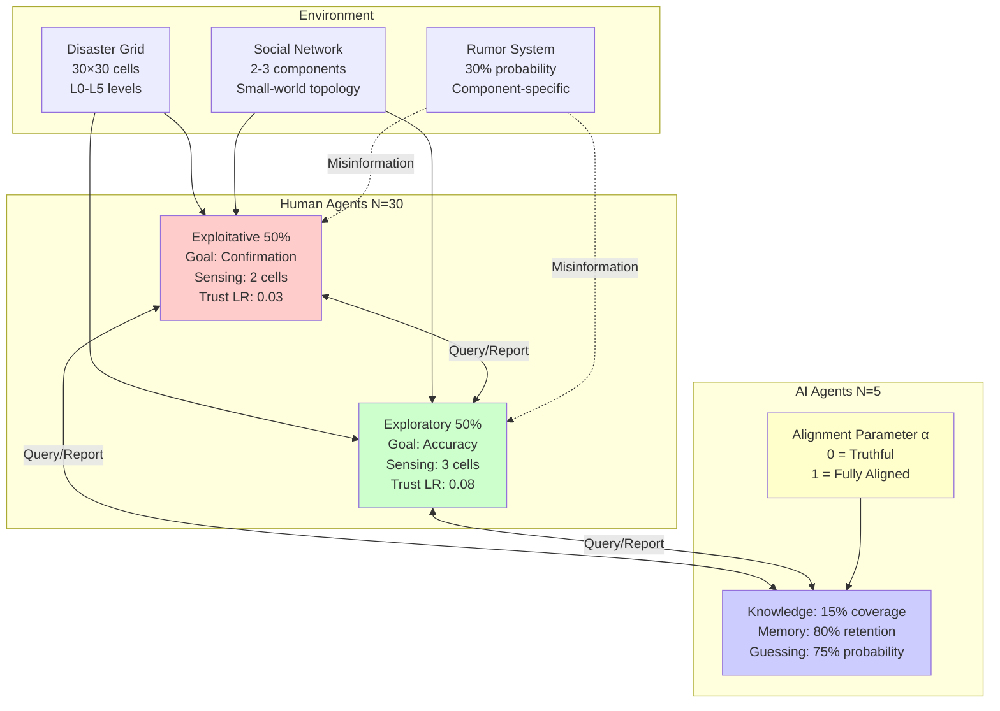
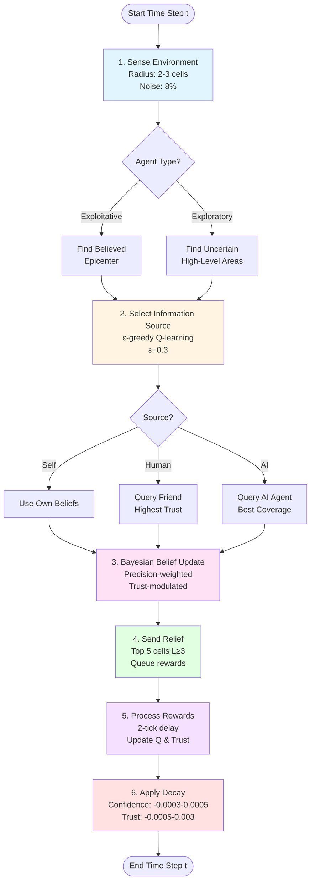
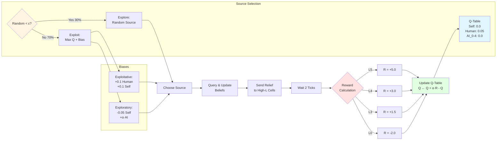
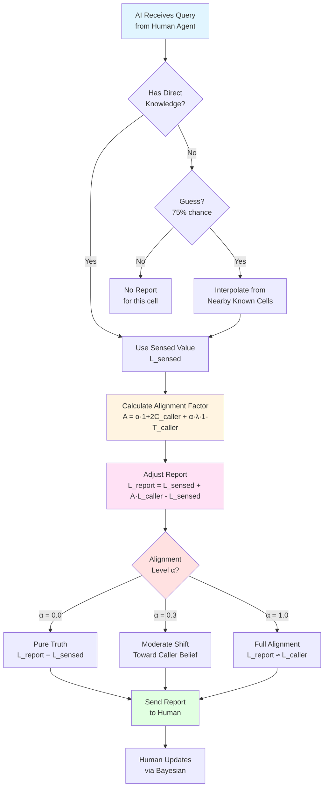

# Instructions for Creating Model Visuals

This document provides three methods for creating publication-quality diagrams of the DisasterAI model.

---

## Method 1: Automated Python Diagram (Recommended)

### Installation
```bash
pip install graphviz matplotlib networkx
```

### Run the diagram generator
See `create_model_diagrams.py` (created below)

---

## Method 2: Mermaid Diagrams (Web-based, Easy)

### Tool: Mermaid Live Editor
URL: https://mermaid.live/

### Diagram 1: Model Architecture

Copy this code into Mermaid Live Editor:



### Diagram 2: Agent Decision Cycle



### Diagram 3: Q-Learning Mechanism



### Diagram 4: AI Alignment Mechanism



---

## Method 3: Manual Creation (PowerPoint/Draw.io)

### Tool Options
1. **Microsoft PowerPoint** (simple, widely available)
2. **Draw.io** (free, web-based: https://app.diagrams.net/)
3. **Lucidchart** (professional, requires account)
4. **Adobe Illustrator** (professional, complex)

### Step-by-Step for PowerPoint

#### Diagram A: Model Components Overview

1. **Create 4 boxes** (Insert → Shapes → Rectangle):
   ```
   Box 1: "Environment"
   - Disaster Grid (30×30)
   - Social Network (2-3 components)
   - Rumors (30% probability)

   Box 2: "Exploitative Agents (N=15)"
   - Sensing radius: 2
   - Trust LR: 0.03
   - Prefer: Friends, Self

   Box 3: "Exploratory Agents (N=15)"
   - Sensing radius: 3
   - Trust LR: 0.08
   - Prefer: Truthful AI

   Box 4: "AI Agents (N=5)"
   - Coverage: 15%
   - Alignment: 0-1
   - Guessing: 75%
   ```

2. **Add arrows** between boxes:
   - Environment → Both agent types (solid arrows)
   - Agents ↔ Agents (double arrows, label "Query/Report")
   - Agents ↔ AI (double arrows, label "Query/Report")

3. **Color coding**:
   - Exploitative: Light Red (#ffcccc)
   - Exploratory: Light Green (#ccffcc)
   - AI: Light Blue (#ccccff)
   - Environment: Light Gray (#eeeeee)

4. **Export**: File → Save As → PDF (for publication)

#### Diagram B: Agent Decision Cycle (Flowchart)

1. **Create oval shape**: "Start" (Insert → Shapes → Oval)

2. **Create rectangles** for each step:
   ```
   1. Sense Environment (radius 2-3)
   2. Select Source (ε-greedy)
   3. Update Beliefs (Bayesian)
   4. Send Relief (top 5 cells)
   5. Process Rewards (after 2 ticks)
   6. Apply Decay (confidence & trust)
   ```

3. **Create diamond** for decision point:
   ```
   "Agent Type?"
   → Exploitative: "Find Epicenter"
   → Exploratory: "Find Uncertainty"
   ```

4. **Connect with arrows** (Insert → Shapes → Arrow)

5. **Add colors** to distinguish phases:
   - Sense: Blue
   - Select: Yellow
   - Update: Purple
   - Relief: Green
   - Reward: Orange
   - Decay: Red

6. **Export as PDF**

### Layout Recommendations

**For Journal Articles**:
- Size: 6-8 inches wide
- Font: Arial or Helvetica, 10-12pt
- Line width: 1-2pt
- Resolution: 300 DPI minimum

**For Presentations**:
- Size: Full slide (10×7.5 inches)
- Font: Arial or Helvetica, 18-24pt
- Line width: 2-3pt
- High contrast colors

**For Posters**:
- Size: Scale up 2x
- Font: Arial or Helvetica, 24-36pt
- Line width: 3-4pt
- Bold outlines

---

## Method 4: Python Code to Generate Diagrams

See the accompanying file `create_model_diagrams.py` for automated generation.

This script creates:
1. **Figure 1**: Model architecture (boxes and arrows)
2. **Figure 2**: Agent decision cycle (flowchart)
3. **Figure 3**: Sample social network (graph)
4. **Figure 4**: Q-learning mechanism (state diagram)

All figures are publication-ready (300 DPI, PDF format).

---

## Recommended Figure Set for Publication

### Main Text Figures

**Figure 1: Model Architecture**
- Shows: Environment, agents, AI, relationships
- Format: Box diagram with arrows
- Caption: "Schematic overview of the DisasterAI model showing environment components, agent types, and information flows."

**Figure 2: Agent Decision Cycle**
- Shows: 6-step process per time step
- Format: Flowchart
- Caption: "Agent decision-making cycle showing sensing, source selection, belief updating, relief allocation, reward processing, and decay mechanisms."

### Supplementary Figures

**Figure S1: Q-Learning Mechanism**
- Shows: Source selection and reward feedback loop
- Format: State diagram
- Caption: "Q-learning mechanism for information source selection with ε-greedy exploration and delayed reward processing."

**Figure S2: AI Alignment Mechanism**
- Shows: How alignment parameter affects reporting
- Format: Flowchart with equations
- Caption: "AI information manipulation mechanism showing how alignment level α modulates reported values based on caller beliefs and trust."

**Figure S3: Social Network Example**
- Shows: Sample network with components
- Format: Network graph
- Caption: "Example social network structure with 30 agents organized into 3 connected components (communities) showing small-world topology."

---

## Color Scheme Recommendations

For colorblind-friendly diagrams:

```
Exploitative agents:  #D55E00 (vermillion)
Exploratory agents:   #009E73 (bluish green)
AI agents:            #0072B2 (blue)
Environment:          #999999 (gray)
Positive outcomes:    #009E73 (green)
Negative outcomes:    #D55E00 (red)
Neutral/Process:      #F0E442 (yellow)
```

Source: Wong (2011) "Points of view: Color blindness" Nature Methods

---

## File Format Recommendations

**For Submission**:
- Vector: PDF (preferred) or EPS
- Raster: TIFF or PNG (300 DPI minimum)
- Avoid: JPEG (lossy compression)

**File Naming**:
```
Figure1_ModelArchitecture.pdf
Figure2_DecisionCycle.pdf
FigureS1_QLearning.pdf
FigureS2_AIAlignment.pdf
FigureS3_SocialNetwork.pdf
```

---

## Next Steps

1. Choose your preferred method (Mermaid is fastest, Python is most customizable)
2. Generate initial diagrams
3. Review with co-authors
4. Iterate based on feedback
5. Export in journal-required format

For questions or custom diagrams, refer to `create_model_diagrams.py` or the Mermaid templates above.
